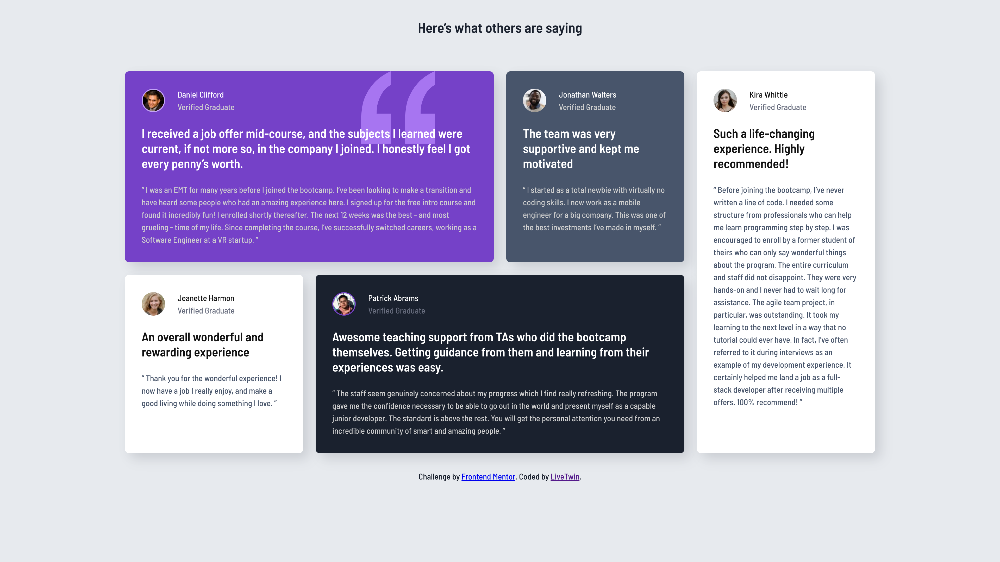

# Frontend Mentor - Testimonials grid section solution

This is a solution to the [Testimonials grid section challenge on Frontend Mentor](https://www.frontendmentor.io/challenges/testimonials-grid-section-Nnw6J7Un7). Frontend Mentor challenges help you improve your coding skills by building realistic projects.

## Table of contents

- [Overview](#overview)

  - [The challenge](#the-challenge)
  - [Screenshot](#screenshot)
  - [Links](#links)

  - [Built with](#built-with)
  - [What I learned](#what-i-learned)
  - [Continued development](#continued-development)
  - [Useful resources](#useful-resources)

- [Author](#author)

**Note: Delete this note and update the table of contents based on what sections you keep.**

## Overview

Testimonial grid challenge from Frontend Mentor focusing on advanced grid methods.

### The challenge

Users should be able to:

- View the optimal layout for the site depending on their device's screen size

### Screenshot



### Links

- Solution URL: [Add solution URL here](https://github.com/LivexTwin/testimonials-grid-section-main)
- Live Site URL: [Add live site URL here](https://testimonial-grid-lt.netlify.app)

### Built with

- Semantic HTML5 markup
- CSS custom properties
- Flexbox
- CSS Grid
- Mobile-first workflow

### What I learned

I am in the process of learning to master **semantic HTML** along with **advanced CSS techniques**. This challenge called for the application of both, which allowed me to experiment with cleaner, more meaningful markup and more complex CSS strategies. Going forward, I plan to integrate tools like **SCSS/SASS** to make my code even more maintainable. Features such as **mixins** and **`@include`** will help me write DRY (Don’t Repeat Yourself) code and avoid the repetition of utility classes, especially in larger projects.

```css
@media (min-width: 30em) {
  .testimonial-grid {
    grid-template-areas:
      "one one"
      "two five"
      "three five"
      "four four";
  }
}

@media (min-width: 50em) {
  .testimonial-grid {
    grid-template-areas:
      "one one two five"
      "three four four five";
  }
}
```

### Continued development

"In future projects, I want to focus on mastering semantically perfect HTML and refining my ability to write efficient, DRY (Don't Repeat Yourself) CSS. I aim to develop a deeper understanding of structuring content in a way that enhances accessibility and SEO while keeping the code concise and maintainable. Additionally, I plan to continue honing my JavaScript skills, with a particular emphasis on writing clean, functional code that avoids overengineering. My goal is to learn to focus on what truly matters for the user experience and to efficiently ship projects that meet their needs without unnecessary complexity."

### Useful Resources

Although I didn’t use SCSS/SASS for this particular project, I definitely plan on using it for future use cases. SCSS/SASS will allow me to write cleaner, more maintainable code, and I see a lot of potential in using mixins and `@include` to avoid repeating utility classes.

- [Sass Official Website](https://sass-lang.com) - This website is a great resource for learning about SCSS/SASS. It has detailed documentation on how to use mixins, variables, and other features that will help me make my code more efficient.

In a larger use case, I believe SCSS/SASS would be incredibly helpful, especially with mixins and `@include`, which would allow me to avoid repeating utility classes and keep my code DRY (Don’t Repeat Yourself). I’m excited to incorporate SCSS into future projects for a more scalable and efficient workflow.

## Author

- Website - [Add your name here](https://www.a-is-lt.com)
- Frontend Mentor - [@yourusername](https://www.frontendmentor.io/profile/LiveXTwin)
